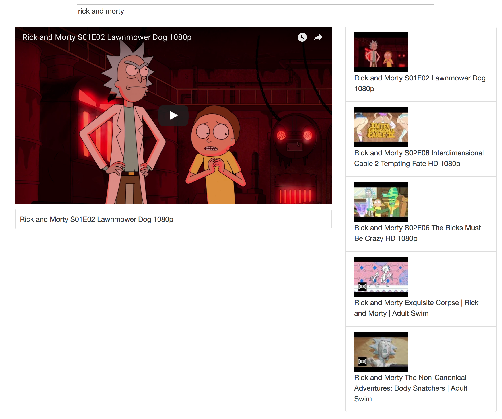

# Youtube Video Browser

###Installation Instructions:
1. download/Clone Repository
2. cd into main directory
3. type 'npm start' in terminal
4. navigate to localhost:8080 in browser
5. start typing query in search input to see results
6. click on video thumbnail to load into player
7. enjoy!

